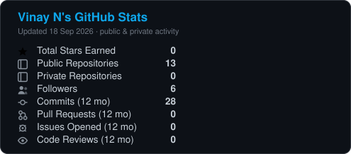
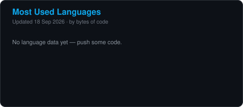
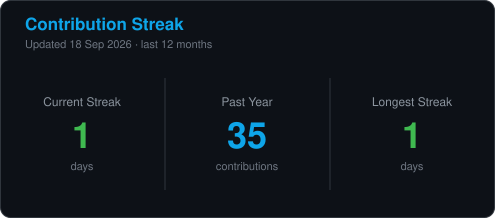

 

### 🎓 B.Tech CSE (Cyber Security) @ Alliance University &nbsp;·&nbsp; 📍 Bengaluru, India

**I build websites, apps and tools that actually ship — and I break things (ethically) to understand how they work.**

 

---

## 👋 About me

I'm **Vinay N**, a Computer Science (Cyber Security) undergrad and a developer who likes the whole stack — from a landing page that converts, to the API behind it, to the shell that runs it.

- 🔭 Currently building **web platforms for real clients** and studying **CEH v13 (AI)**
- 🌱 Learning **AI, Blockchain and advanced offensive security**
- 🛡️ Founded and led **Indian Cyber Punk (I.C.P)** — a cybersecurity community
- 💬 Ask me about **Python, Flask, PHP, Linux, networking or web development**
- ⚡ The fastest way to learn how a system works is to try to break it — legally, in your own lab.

---

## 🚀 What I do

| | |
|---|---|
| 🛡️ **Cyber Security** | Ethical hacking, vulnerability assessment, network security & threat analysis |
| 🌐 **Web Development** | Front-end to full-stack — landing pages, business sites, admin panels & APIs |
| 📱 **Mobile Apps** | Android & iOS application development |
| 🧰 **Software & Tools** | Custom tools, automation scripts and utilities built to solve real problems |

---

## 🧠 Tech Stack

**Languages**

**Web & Backend**

**Security**

**Tools & Platforms**

---

## 💼 Featured Work

Real products, live and in use:

| Project | What it is | Link |
| :--- | :--- | :---: |
| 🏠 **Alliance PG** | Premium PG accommodation platform with rooms, meals & enquiry management — built for students near Alliance University | [alliancepg.in](https://alliancepg.in) |
| 🌍 **LandPedia** | Digital land-record & property-rights platform | [landpedia.in](https://landpedia.in) |
| 🔧 **Paraspara Service** | Service business website & booking flow | [parasparaservice.com](https://parasparaservice.com) |
| 🛡️ **Paraspara Security** | Corporate security services website | [parasparasecurity.com](https://parasparasecurity.com) |

---

## 📌 Featured Repositories

| Repo | Description |
| :--- | :--- |
| [**signature-scanner**](https://github.com/vinaynayak2007/signature-scanner) | AV-engine scanner built from scratch — hash signatures + 7 scored heuristic rules, quarantine, HTML reporting. 33 tests, zero dependencies |
| [**pe-analyzer**](https://github.com/vinaynayak2007/pe-analyzer) | Windows PE analyser built from scratch — raw struct parsing, section entropy, import table walking, 11 scored detection rules. 44 tests, zero dependencies |
| [**background-remover**](https://github.com/vinaynayak2007/background-remover) | Full-stack AI background removal service — Flask + rembg backend, REST API, Dockerized and deployed on Render |
| [**alliance-pg**](https://github.com/vinaynayak2007/alliance-pg) | Case study: the accommodation platform behind alliancepg.in |
| [**landpedia**](https://github.com/vinaynayak2007/landpedia) | Case study: digital land-record & property-rights platform |
| [**HACK_LAB**](https://github.com/vinaynayak2007/HACK_LAB) | My personal ethical-hacking lab — Linux, networking & security command reference |
| [**vinu_nayak**](https://github.com/vinaynayak2007/vinu_nayak) | Source for my personal portfolio site |

---

## 🏅 Certifications & Training

- 🛡️ **Certified Ethical Hacker (CEH v13 — AI)** &nbsp;·&nbsp; *in progress*
- 🐧 **Linux Administration (RHCSA)**
- 🪟 **Windows Server Administration (MCSA)**
- 🌐 **Cisco Certified Network Associate (CCNA)**
- 📡 **Computer Networking (Network+)**
- 🔩 **Computer Hardware (A+)**

---

## 🎓 Education

**B.Tech — Computer Science (Cyber Security)** · Alliance University · *2025 – 2029*
**PUC (PCMB)** · Maharaja's College, Mysore · *2021 – 2023*

---

## 📊 GitHub Stats

Self-hosted — generated by <a href="./stats-src/generate_stats.py">my own script</a> and committed as files.
No third-party badge services, so these can't break when someone else's server goes down.

---

## 🤝 Let's connect

  

**Open to freelance web development, security audits and collaboration.** 
*If you found a bug in one of my projects, open an issue — or a PR. Either is a compliment.* 🛡️

